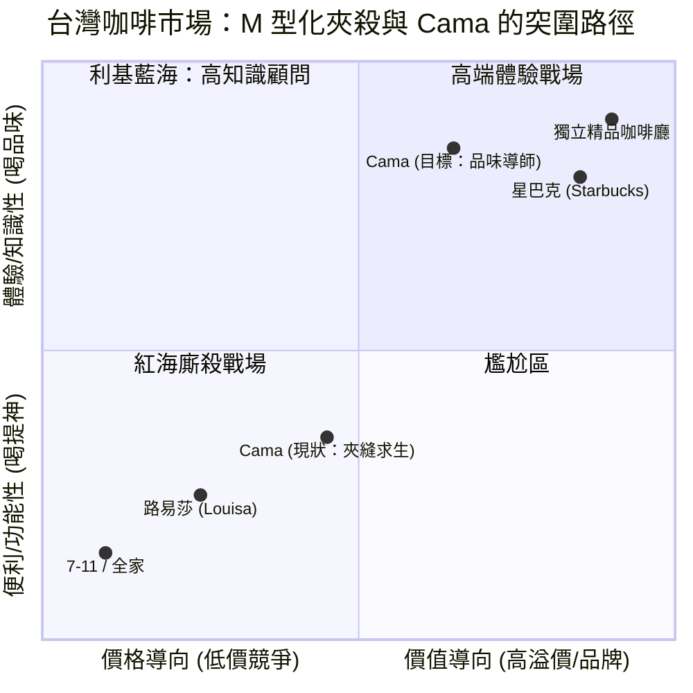

# {{ $frontmatter.title }}

<!--
- 依據這張圖延伸描述 cama 在這裡最大的尷尬點
- 強調「付出」的足夠，但方向的錯誤

## 超商
- 價格低廉、方便汲取
- 品質穩定（雖然低下）、不給驚喜

## 星巴克
- 價格穩定、方便快速
- 品牌經營、潮流興起

## 路易莎
- 價格親民、方便快速
- 多元用途、客源寬廣

## 獨立咖啡廳
- 精神價值、特色突出
- 品牌經營、標的存在
-->
